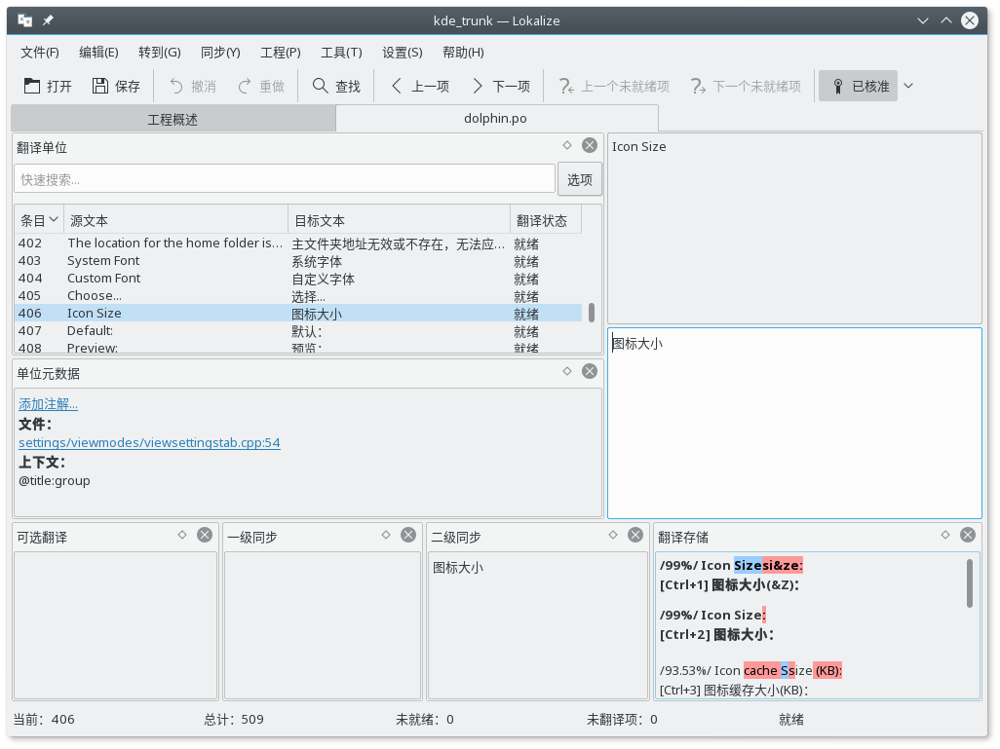

# KDE 中文翻译项目结构化脚本

> 注意，这个 Git 只是提供了脚本，不接受翻译提交……

这些个脚本目的是帮助新手不用去浏览庞杂的 SVN 目录结构就能快速开始工作。也避免翻译错了版本什么的。同时也减轻 Lokalize 的配置负担，这个软件还不是很直观，选项比较多。

## 使用需求

1. GNU/Linux 操作系统
2. Lokalize，KDE 的项目翻译工具
3. Subversion (SVN)，KDE使用的源代码管理工具
4. Kompare, KDE 的 diff 工具

## 新人入门

### 步骤一：初始化项目结构，下载翻译文件

```shell
git clone git@github.com:guoyunhe/kde-cn.git

cd kde-cn
```

如果您还没有 KDE 开发者账号：

```shell
./init.sh
```

如果您已有 KDE 开发者账号，请运行：

```shell
./init.sh --dev
```

### 步骤二：配置 Lokalize

打开 Lokalize 程序，在菜单里选 **配置** > **配置 Lokalize** 。填写您的醒目和邮件，邮件列表应该是 kde-china@kde.org 。


### 步骤三：打开翻译项目

在 Lokalize 的菜单栏中点击 **打开项目** 。然后打开 git 目录中的 trunk.localize 项目文件，或者 stable.localize 项目文件。

Trunk 指的是未发布的开发版代码，而 Stable 是最新发布的稳定版代码。建议您优先翻译 Trunk 分支，然后通过二级同步将 Trunk 分支的翻译复制到 Stable 分支。


### 步骤四：添加翻译存储

在 Lokalize 项目界面，右击 **messages** 文件夹，添加到翻译存储。


翻译存储可以方便借用已经翻译过的文字来翻译类似的新条目。

### 步骤五：翻译文件

在项目视图中选择要编辑的文件，点击打开。



除了选择条目手动编辑之外，您还应当参考左侧的 **注释** 以免弄错使用场景。

底部的 **可选翻译**, **一级同步**, **二级同步**, **翻译存储** 可以帮助您避免重复劳动，加快翻译进度。


## 下载更新

翻译文件很多，基本上每天都会变动。为了避免文件冲突，请尽量每天翻译之前更新一下。

```shell
./update.sh
```

## 分支同步

尽管有些差异，Stable 和 Trunk 大部分内容是相同的。如果您翻译了 Trunk 分支，可以用二级同步复制到 Stable 分支。打开 Stable 工程，在菜单栏中选择 **同步** --> **二级同步** --> **复制所有新翻译** 。


## 提交翻译

### 社区新人

1. 加入邮件列表，发送一封内容随意的邮件给 <kde-china-request@kde.org> 即可。
2. 请将翻译过的 po 文件发送到邮件列表 <kde-china@kde.org> 并耐心等待。

### KDE 开发者

如果你有 KDE 开发者账号，开通了 SVN 提交权限，那么就可以使用以下脚本来检查和提交翻译。

```shell
# 检查更改
./diff.sh

# 提交翻译
./commit.sh
```

## 目录结构和优先级

如果您还没有想好要翻译哪些文件，可以挑选那些重要的，常用的部分来翻译。

最重要的三个文件夹：

1. kde-workspace
2. frameworks
3. applications

待补充...
