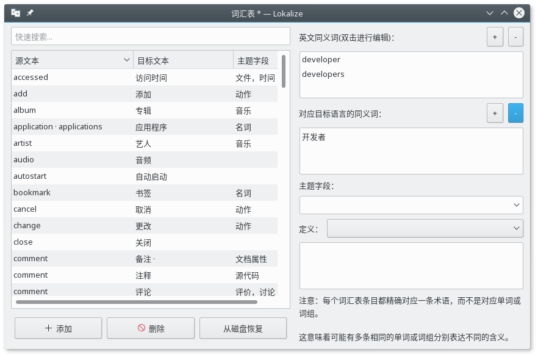

# KDE 中文翻译项目结构化脚本

> 注意，这个 Git 只是提供了脚本，不接受翻译提交……

这些个脚本目的是帮助新手不用去浏览庞杂的 SVN 目录结构就能快速开始工作。也避免翻译错了版本什么的。同时也减轻 Lokalize 的配置负担，这个软件还不是很直观，选项比较多。

## 使用需求

1. GNU/Linux 操作系统
2. Lokalize，KDE 的工程翻译工具
3. Subversion (SVN)，KDE使用的源代码管理工具
4. Kompare, KDE 的 diff 工具

## 新人入门

### 步骤一：初始化工程结构，下载翻译文件

```shell
git clone git@github.com:guoyunhe/kde-cn.git

cd kde-cn
```

如果您还没有 KDE 开发者账号：

```shell
./init.sh
```

如果您已有 KDE 开发者账号，请运行：

```shell
./init.sh --dev
```

### 步骤二：配置 Lokalize

打开 Lokalize 程序，在菜单里选 **配置** > **配置 Lokalize** 。填写您的醒目和邮件，邮件列表应该是 kde-china@kde.org 。


### 步骤三：打开翻译工程

在 Lokalize 的菜单栏中点击 **打开工程** 。然后打开 git 目录中的 trunk.localize 工程文件，或者 stable.localize 工程文件。

Trunk 指的是未发布的开发版代码，而 Stable 是最新发布的稳定版代码。建议您优先翻译 Trunk 分支，然后通过二级同步将 Trunk 分支的翻译复制到 Stable 分支。


### 步骤四：添加翻译存储

在 Lokalize 工程界面，右击 **messages** 文件夹，添加到翻译存储。


翻译存储可以方便借用已经翻译过的文字来翻译类似的新条目。

### 步骤五：翻译文件

在工程视图中选择要编辑的文件，点击打开。


除了选择条目手动编辑之外，您还应当参考左侧的 **注释** 以免弄错使用场景。

底部的 **可选翻译**, **一级同步**, **二级同步**, **翻译存储** 可以帮助您避免重复劳动，加快翻译进度。


## 下载更新

翻译文件很多，基本上每天都会变动。为了避免文件冲突，请尽量每天翻译之前更新一下。

```shell
./update.sh
```

## 分支同步

尽管有些差异，Stable 和 Trunk 大部分内容是相同的。如果您翻译了 Trunk 分支，可以用二级同步复制到 Stable 分支。打开 Stable 工程，在菜单栏中选择 **同步** --> **二级同步** --> **复制所有新翻译** 。


## 术语表

为了统一翻译一些专用术语，避免分歧，我整理了一个术语表文件 `terms.tbx` 。如果您想参照术语表中的词汇，可以在 Lokalize 编辑界面中右击 **翻译存储** 标题栏，勾选 **词汇表** 。


如果想添加自己的术语，请用 **工具** --> **词汇表** 打开词汇表编辑界面。新添加和修改的词汇需要重启 Lokalize 之后才会显示在编辑界面中。




## 提交翻译

### 社区新人

1. 加入邮件列表，发送一封内容随意的邮件给 <kde-china-request@kde.org> 即可。
2. 请将翻译过的 po 文件发送到邮件列表 <kde-china@kde.org> 并耐心等待。
3. 有问题可以在 Freenode 上的聊天室 [#kde-cn](https://webchat.freenode.net/?channels=#kde-cn) 即时交流。

### KDE 开发者

如果你有 KDE 开发者账号，开通了 SVN 提交权限，那么就可以使用以下脚本来检查和提交翻译。

```shell
# 检查更改
./diff.sh

# 提交翻译
./commit.sh
```

## 目录结构和优先级

第一级目录： stable 和 trunk 分别是两个分支，子目录结构大致类似。

第二级目录： zh_CN 是我们要翻译的翻译文件，templates 是翻译模板，zh_TW 繁体中文作为参考借鉴。

第三级目录： docmessages 是文档翻译，优先级较低； messages 是软件界面翻译，优先级较高。

第四级目录： 按照软件类别分类

最重要的三个目录：

1. kde-workspace 桌面和系统设置的主要内容
2. frameworks 系统组件之类的
3. applications 核心应用，比如 Dolphin 文件管理器，Kate 编辑器，Konsole 终端

主要应用程序目录：

1. pim - 邮件，日历，通讯录，聊天等应用。
2. kdepim-runtime - 支持 pim 应用的后台服务。
3. calligra - 文档，图表，绘画等办公应用。然而由于 Linux 用户使用 LibreOffice 和 OpenOffice 的较多，翻译需求并不很急迫。可优先翻译 krita。
4. kdegraphics - 图像查看器，截图工具，去色其，屏幕标尺，扫描仪和 PDF 查看器。gwenview，spectacle 和 okular 是关键应用。
5. kdemultimedia - 音视频编辑器和播放器。dragonplayer 和 kdenlive 是比较重要的应用。
6. kdeutils - 压缩工具，计算器，计时器等小工具。虽然是小工具，但是还都挺常用的。
7. kdenetwork - 网络账户集成，在线分享，网络存储，远程控制等。
8. kdeedu - 教育和科学应用。其中 marble 是很关键的应用。
9. kdegames - 内置小游戏。
10. kdeadmin - 系统管理工具，配置 systemd 服务和 cron 计划任务。
11. kdesdk - 翻译工具和编辑器等开发工具。一般只有开发者需要。

附加应用程序目录：

1. 以 **extragear-** 开头的目录是一些不常用软件和插件，通常不会默认安装，优先级比较低。
2. 以 **playground-** 开头的目录是一些新的还不稳定的应用，优先级低。

其他目录：

1. kdereview - 好像是正在审核的应用。
2. wikitolearn - 好像是一个在线教育网站，貌似和 KDE 没有直接联系，不建议翻译。


如果您还没有想好要翻译哪些文件，可以挑选那些重要的，常用的部分来翻译。在开始翻译之前，最好在邮件列表或者 IRC 上吼一声，避免几个人翻译同一个文件，重复劳作。


## 参考链接

1. 简体中文翻译租维基主页 <https://community.kde.org/KDE_Localization/zh-cn>
2. Trunk 分支翻译进度 <https://l10n.kde.org/stats/gui/trunk-kf5/team/zh_CN/>
3. Stable 分支翻译进度 <https://l10n.kde.org/stats/gui/stable-kf5/team/zh_CN/>
